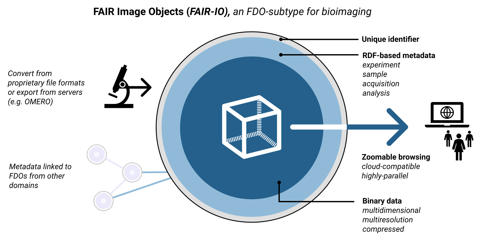
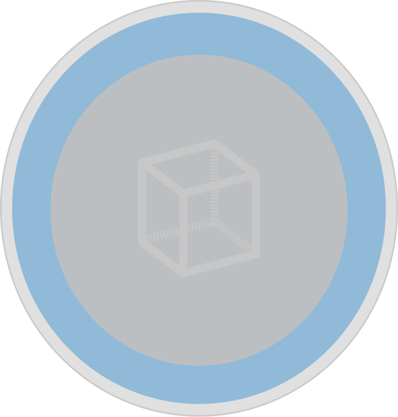

# What is a FAIR-IO
A FAIR-IO (FAIR Image Object) bundle combines acquisition and provenance metadata together with multi-resolution, chunked binary pixel data in a single cloud-compatible format for simplified sharing and re-use. As such, FAIR-IO implements
a FAIR Digital Object (FDO, [DOI:10.5281/zenodo.7824714](https://doi.org/10.5281/zenodo.7824714)) as illustrated below.

FAIR-IO is based on the following recommendations for binary (pixel) data and textual metadata.
## Recommendations for easily sharable binary data:

<table style="margin-left:5px;">
<tr>
    <!--<td style="text-align:left;"></td>-->
    <td>
        <ul>
          <li>Use data formats that store binary data with multiple resolutions in a single cloud-compatible, chunkable format. These enable web-optimised data access and high-performance cloud storage</li>
          <li>Store data in a public available space accessible via a data specific URL</li>
        </ul>
    </td>
</tr>
</table>

**Example format**: OME-Zarr ([About](https://doi.org/10.1007/s00418-023-02209-1) | [Tools](../tools/index.md))

## Recommendations for easily sharable metadata:

<table style="margin-left:5px;">
<tr>
    <!--<td style="text-align:left;"></td>-->
    <td>
        <ul>
          <li>Ensure that the relationship and meaning of the data is clear described or linked</li>
          <li>Use metadata formats that store metadata in a machine readable form, that means </li>
          <li>store data in a public available space accessible via a data specific URL</li>
        </ul>
    </td>
</tr>
</table>

**Example formats**:JSON-LD ([About](https://json-ld.org/) | [Tools](../tools/index.md)), Turtle ([About](https://www.w3.org/TR/turtle/) | [Tools](../tools/index.md))
